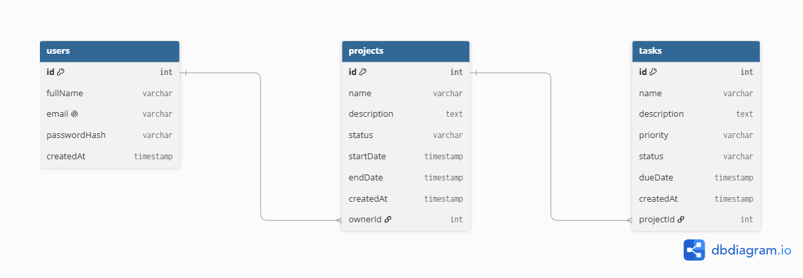

# Project Management System

A project management system with a web app, an Android app and one shared backend.

## Links

- Web app: https://pms-srishti19.vercel.app
- Backend API: https://pms-backend-k497.onrender.com/api
- Health check: https://pms-backend-k497.onrender.com/health
- GitHub: https://github.com/srishti-1935/pms
- API docs: [API.md](API.md)

Note: the backend runs on a free tier and sleeps when idle. Open the health check link first and wait a few seconds before using the apps.

## Features

- Register, login and logout with JWT authentication
- Create, view, edit and delete projects
- Create, edit, complete and delete tasks inside a project
- Search and filter by status and priority
- Dashboard with total projects, total tasks, completed tasks, pending tasks and projects in progress
- Android app with the same account and data, pull to refresh, offline message and session expired handling

## Tech stack

- Backend: Node.js, Express, Prisma 6, Neon PostgreSQL (hosted on Render)
- Web: React, Vite, Axios (hosted on Vercel)
- Mobile: Expo SDK 57, React Navigation, SecureStore, NetInfo, Axios (APK built with EAS)

## Project structure

```
pms/
  backend/   Express API and Prisma schema
  web/       React web app
  mobile/    Expo Android app
  docs/      ER diagram
```

## ER diagram



## API documentation

All endpoints, request bodies and responses are listed in [API.md](API.md). The API base path is `/api`.

## Run locally

Requirements: Node.js 18 or newer and a PostgreSQL database (Neon works).

### Backend

1. `cd backend`
2. `npm install`
3. Copy `.env.example` to `.env` and fill in the values (database URL, JWT secret, `JWT_EXPIRES_IN`, `CLIENT_ORIGIN`)
4. `npx prisma migrate deploy`
5. `npm run dev`

### Web

1. `cd web`
2. `npm install`
3. Set the API URL in the web `.env` file to your backend `/api` URL
4. `npm run dev`
5. Open http://localhost:5173

### Mobile

1. `cd mobile`
2. `npm install`
3. Set `EXPO_PUBLIC_API_URL` to your backend `/api` URL
4. `npx expo start`

To build the APK: `eas build -p android --profile preview`

## Environment variables

Never commit `.env` files. Use `backend/.env.example` as the template.

| Variable | Purpose |
| --- | --- |
| DATABASE_URL | Neon PostgreSQL connection string |
| JWT_SECRET | Secret used to sign tokens |
| JWT_EXPIRES_IN | Token lifetime, for example 7d |
| CLIENT_ORIGIN | Allowed web origins for CORS, comma separated |
| EXPO_PUBLIC_API_URL | API URL used by the mobile app |

## Deployment

- Backend: Render, database on Neon
- Web: Vercel
- Android: EAS build, preview profile, APK
